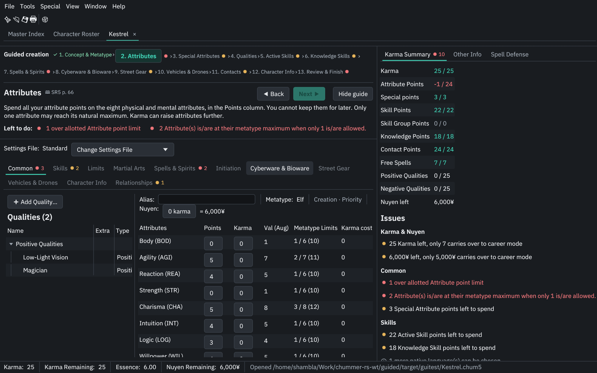
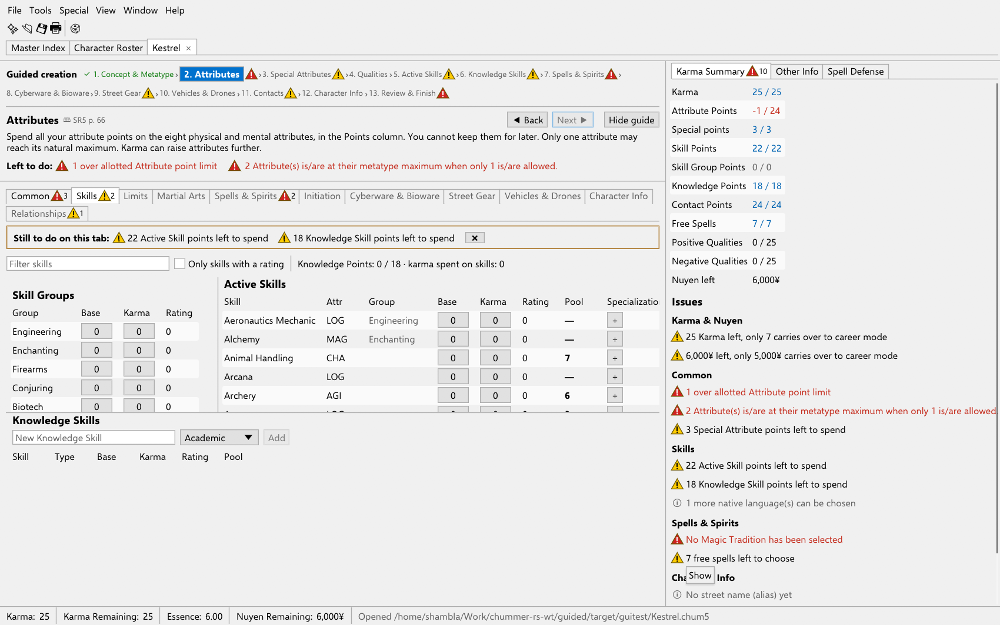

# chummer-rs

A Rust rewrite of [Chummer5a](https://github.com/chummer5a/chummer5a), the
Shadowrun 5th Edition character manager. It runs natively on Linux,
Windows and macOS: no Wine, no .NET, no Internet Explorer.

> **Derived from Chummer5a.** chummer-rs is an independent port of
> [chummer5a/chummer5a](https://github.com/chummer5a/chummer5a)
> (GPL-3.0). The rules logic was ported from Chummer5a's C# source. The
> game data, translations, custom data, character sheets and export
> templates in `resources/` are copied from Chummer5a unchanged. Its test
> characters are used as test fixtures. All credit for the original
> program and its data goes to the Chummer5a authors. chummer-rs is not
> affiliated with or endorsed by the Chummer5a project.

chummer-rs reads and writes the same `.chum5` (and compressed `.chum5lz`)
files and uses Chummer5a's own game data, custom data and character
sheets. Characters move between the two programs: files created by chummer-rs load in Chummer5a 5.226 without
warnings (see [docs/interop.md](docs/interop.md)).

## Download

Prebuilt packages for Linux, Windows and macOS are on the
[Releases](../../releases) page. Unpack and run `chummer-rs` (`chummer-rs.exe`
on Windows). Keep the `resources` folder next to the program.

On macOS, unzip and move `chummer-rs.app` to Applications. The app is
not notarised by Apple, so the first time right-click it and choose
Open (or run `xattr -dr com.apple.quarantine /Applications/chummer-rs.app`).
`chummer-cli` is inside the bundle, in `chummer-rs.app/Contents/MacOS/`.

Character sheets need `xsltproc`:
- Linux: it is in the `libxslt` package.
- macOS: it comes with the system.
- Windows: put `xsltproc.exe` on your PATH.

## Build from source

You need a Rust toolchain (1.85 or newer) and, for character sheets,
`xsltproc` (package `libxslt`).

```bash
./install.sh
```

This installs to `~/.local`:

- `chummer-rs`: the desktop application.
- `chummer-cli`: the command-line tool.
- The game data, in `~/.local/share/chummer-rs`.
- A desktop entry, so `.chum5` files open with chummer-rs.

The GUI is called `chummer-rs` so that it never replaces a `chummer`
launcher you may have for Chummer5a under Wine.

To run from the source tree:

```bash
cargo run --release -p chummer-gui -- path/to/character.chum5
```

## Features

### Characters

**Creation.** File → New character (Ctrl+N) supports these build methods:

| Build method | How it works |
|---|---|
| Priority | Five priorities, each letter used once. |
| Sum-to-Ten | Priority values must add up to the preset's total. |
| Point Buy | Everything is bought with karma. |
| Life Modules | Karma build plus life modules added by stage. |

The wizard covers:
- Metatype and metavariant.
- Magic or resonance talent, with its free skills.

A Creation panel shows what is left of each budget:
- Karma.
- Attribute and special attribute points.
- Skill and skill group points.
- Knowledge and contact points.
- Spells and power points.
- Nuyen, including karma converted to nuyen.
- Quality limits.

**Creation issues.** While a character is in creation, chummer-rs checks
it all the time with Chummer's finish-creation rules, so the problems do
not wait for a pop-up at the end:
- Errors block Finish creation: overspent attribute, special, skill and
  skill group points, karma or nuyen; too many attributes at their
  maximum; more than one specialization per skill; quality limits; adept
  power points; no tradition for a magician; Essence at 0; too many native
  languages, martial arts or techniques; a contact worth more than 7
  points; items above the allowed Availability (Restricted Gear is
  counted); banned ware grades; items over their capacity.
- Warnings are reminders: unspent points of any pool, free spells and
  power points left, more karma or nuyen than carries over, a mentor
  spirit not chosen yet, no technomancer stream.
- Each tab with issues has a warning badge with the count (Classic: a
  yellow warning sign; Graphite: a coloured dot). The focused tab shows
  its issues at the top; click one to go to the row or item. ✖ hides the
  panel until something changes. Rows with a problem have a warning mark.
- The Karma Summary lists every issue, and Finish creation shows the
  full list before it switches to career mode, carrying over at most 7
  karma and 5,000¥.

**Guided creation.** For new players, a guide bar walks through the build
one step at a time. Turn it on in the New Character wizard or with
View → Guided creation (saved in `gui.ini`). The steps follow the build
method:

| Build method | Steps |
|---|---|
| Priority, Sum-to-Ten | Concept & metatype → attributes → special attributes → qualities → active skills → knowledge skills → spells / adept powers / complex forms (if the character has them) → cyberware → street gear → vehicles → contacts → character info → review & finish |
| Point Buy | Concept & metatype → qualities (magic and resonance are qualities here) → attributes → special attributes → skills → … as above |
| Life Modules | Concept & metatype → life modules → qualities → attributes → … as above |

Each step explains its rule in plain words, with a 📖 link to the
rulebook page (SR5 or Run Faster), and lists what is still to do there.
Next is allowed when the step has no errors; the step chips let you jump
anywhere. Tabs outside the current step are dimmed, not locked. The
current step is remembered per file in `~/.config/chummer-rs/guide.ini`,
not in the .chum5.




**Career mode.**
- Raise attributes, skills, skill groups and knowledge skills for karma at Chummer's costs.
- Buy specializations, qualities and spells.
- Buy off negative qualities.
- Initiate or submerge (group, ordeal and schooling discounts). A mystic adept with the second-MAG house rule is also limited by MAGAdept.
- Learn martial arts and their techniques.
- Learn metamagics and echoes at a chosen grade (the lowest grade without one is preselected). The first one at a grade is free; each further one costs karma.
- Buy critter powers.
- Buy A.I. programs and Advanced Programs. Undo refunds the karma and removes the program (Chummer keeps it); it is refused while another program the character has requires it.
- Bind foci, up to MAG foci and MAG × 5 total force.
- Fetter a spirit (Force × 3 karma) or a sprite (Force karma). A fettered spirit lowers MAG by 1 and gains Banishing Resistance (Street Grimoire p. 192; Chummer does not add it). Undoing the fettering expense releases the spirit again.
- Join or leave a magical group, and quicken spells.
- Spend and regain Edge, burn a point of Edge and burn street cred.

Every purchase is written to the karma/nuyen ledger. The Karma & Nuyen tab:
- Lists the ledger with Undo.
- Takes manual income and expenses.
- Shows career karma, street cred, notoriety and public awareness.

The calendar tracks in-game weeks.

**At the table** (career mode), as in Chummer5a's career form:
- Edge boxes in the sidebar: click a box to mark Edge spent up to it, or reset it all for a new session (`<edgeused>`).
- Weapon ammunition: clips per slot (accessories add slots), reload from
  the ammunition the character or vehicle carries (split off the stack,
  spare clips and speed loaders, external sources), unload back onto the
  stack, and fire single shots, bursts, full bursts and suppressive fire.
  Weapons with charges reload to their capacity.
- Devices (commlinks, decks, cyberware, vehicles) show their matrix
  attributes and a matrix condition monitor, and one can be the active
  commlink, which sets matrix initiative. An A.I. can make a device its
  home node (Program Limit 2 when Depth is above the device rating).
- Vehicles and drones have a damage track.

**Rules.** The following are computed:
- Attributes, with improvement stacking and cyberlimbs.
- Essence and essence loss, in creation and career mode (in career mode, loss beyond the minimum burns MAG/RES/DEP karma levels, as in Chummer).
- Initiative, condition monitors and limits.
- Derived pools and armor.
- Skill dice pools.
- Weapon stats: DV with STR, AP, accuracy, recoil, ranges and dice pool.
- Vehicle and drone stats after mods.
- Drain and fading.
- Adept power points.

### Equipment and magic

You can add items from the game data with:
- Rating, quantity and grade choices.
- Availability checked against the creation limit.
- A cost preview.

Supported kinds:
- Gear, with nested gear.
- Cyberware and bioware, with grades, cyberlimbs and subsystems.
- Armor and armor mods.
- Weapons, with accessories and underbarrels.
- Vehicles and drones, with mods and weapon mounts.
- Lifestyles, with lifestyle qualities.
- Custom drugs, priced by their grade.
- Spells (limited, extended, alchemical), adept powers, complex forms, spirits and sprites.
- Metamagics and echoes, mentor spirits with their choices, martial arts and techniques, and critter powers.
- A.I.s: programs and Advanced Programs (creation karma with the free program slots, requirements), Edge maximum equal to Depth, a Core or vehicle track and the home node's Matrix track, limits, matrix initiative and spell defense from the home node.

Click an item to edit its rating, quantity, equipped and wireless state,
custom name, location and notes, add things inside it, or sell it.

The "bonus" of every quality, piece of ware, power and item applies, just
as in Chummer5a. Every bonus type in the game data is handled.

**Custom improvements.** On the Improvements tab (career mode; in
creation, as in Chummer, the tab only shows once a character has custom
improvements), a GM can add one-off modifiers of any type in `improvements.xml`
(Add Improvement), for example +1 Agility or an extra condition monitor
box. They can be edited, deleted, turned on and off, sorted into groups
(with Enable All / Disable All), and given notes. They are saved in
Chummer5a's format (`<custom>`, `<customname>`, `<customgroup>`,
`<improvementgroups>`). The tab also lists every automatic improvement.

Item requirements (`<required>`/`<forbidden>`) are checked.

**Relationships.** The Relationships tab has Chummer's Contacts, Enemies
and Pets & Cohorts sub-tabs. Contacts and enemies have name, location,
archetype, connection, loyalty, the Free/Group/Blackmail/Family flags and
an expandable stat block (type, metatype, gender, age, personal life,
preferred payment, hobbies/vice) with `contacts.xml`'s lists; pets have a
name and a `critters.xml` metatype. Contacts can also be added from a
Chummer contacts XML file (Add from File). Any entry can be linked to
another `.chum5` or `.chum5lz` (Attach Character): its name, metatype,
gender, age and mugshot then come from that file, on screen and on
printed sheets, and Open Character opens it in a new tab. The link is
saved as Chummer saves it (`<file>` as picked, `<relative>` from the
program directory); a link made on Windows also works when the linked
file sits next to the character's own save. A missing linked file shows
a warning and nothing else.

To reorder entries, drag a row by its ☰ handle or use the ⏶/⏷ buttons.
The order is saved as the order of the `<contact>` elements, which is
the order Chummer loads them in. The notes button opens a notes dialog
with Chummer's notes colour (Select Colour). The colour is saved as
Chummer saves it (`ColorTranslator.ToHtml`: a colour name such as
`Chocolate` or `#RRGGBB`), the notes text is shown in it, and in dark
themes it is shown the way Chummer's dark mode shows it. A contact's
`<colour>` tints its row, as Chummer paints the contact control with it.

**Compressed saves.** `.chum5lz` files (Chummer's LZMA-compressed saves)
open, save, show in the roster and recent lists, and work as linked
contacts and in every `chummer-cli` command. Save As keeps the format of
the open file and offers both. The file is the `.chum5` XML in the
`.lzma` format with Chummer's default "Balanced" settings (16 MiB
dictionary, lc 3, lp 0, pb 2, end marker). Files saved with any of
Chummer's compression levels open. Files written by Chummer
5.225 open in chummer-rs, and files written by chummer-rs open in
Chummer 5.225.

### More

- **Undo and redo.** Edit → Undo (Ctrl+Z) and Redo (Ctrl+Shift+Z or
  Ctrl+Y) work on every change to a character, in creation and career
  mode. The menu names the change ("Undo: Raised Pistols to 5 (10
  karma)"). Each open character keeps 100 steps. Typing in one text box
  or dragging one spinner is one step. Undo puts the character back
  exactly as it was, and takes back the karma and nuyen too. This is
  not the Undo button on Karma & Nuyen entries: that one refunds an
  expense by Chummer's rules, and is itself a step you can undo.
  While a text box has the keyboard, Ctrl+Z undoes typing in the box.
- **History.** The History tab in the right-hand panel (or View →
  History) lists this session's changes, newest first, with the time
  and the karma or nuyen they cost. Undone changes stay greyed out until
  a new change replaces them.
- **Commands.** Every change, in the GUI and in `chummer-cli apply`, is a
  command that `chummer_core::command::apply` runs. The same command on
  the same character gives the same file on every machine (new GUIDs and
  dates come from the command). This is the base for GM/player sync
  ([docs/online-design.md](docs/online-design.md)).
- **Sourcebook PDFs.**
  - 📖 links on items, skills and data entries open your PDF at the rule's page, in evince, zathura, okular or another viewer.
  - Tools → Sourcebooks can import your Chummer5a links from a Wine or Proton prefix, scan a folder, and detect page offsets with `pdftotext`.
  - A folder scan matches PDFs by title (`&` and "and" are the same), then, with `pdftotext`, by each book's known text. That finds errata, books printed inside another book's PDF (Data Trails' Dissonant Echoes) and files with odd names. Files it can't link are listed with the reason: another edition, errata with no book of its own, a duplicate, or a book Chummer has no data for.
- **Character sheets** (File → Print, Ctrl+P): Chummer's own XSLT sheets, in all six languages, opened in your browser to view or print.
- **Export** to XML, JSON (Chummer's format) and Squad Manager.
- **Custom data:**
  - All of Chummer5a's optional rule packs can be applied through house-rule presets.
  - Tools → Character settings duplicates and edits presets: build method, budgets, books, karma costs, options and custom data.
  - Share house rules: Export saves a preset as a Chummer settings file (Chummer5a reads it too); Import installs one, and asks before it replaces a different file of the same name.
  - A character whose settings file is not installed shows a warning with an Import button; its budgets use Standard, and its `<settings>` stays as it was until you pick another file with "Change Settings File" (Common tab).
- **Tools:**
  - A data browser (the Master Index tab) that searches every item, quality and spell.
  - Searchable drop-downs: lists with more than 8 entries filter as you type (words in any order); Enter picks the first match.
  - A dice roller (click any skill pool) and an initiative tracker.
  - A character roster (the Character Roster tab).
- **GM tools:**
  - File → New Critter… builds a critter or NPC from `critters.xml`, as Chummer does. Spirits, sprites and other Force creatures are built at a chosen Force: attributes, skills and powers follow from it. Spirits get their optional powers and Materialization (or Possession or Inhabitation). Critters open in career mode with rules ignored.
  - Special → Add PACKS Kit… applies a kit from `packs.xml` to a character in creation: qualities, attributes, skills, skill groups, knowledge skills, adept powers, martial arts, complex forms, A.I. programs, spells, spirits, lifestyles, armor, weapons, cyberware, bioware, gear, vehicles and karma for nuyen. Attribute and skill levels use creation points first, then karma, within the creation maximums. Chummer 5.226 applies no attributes, skills or powers from a kit.
  - Special → Create PACKS Kit… saves the character's things as a Custom kit in `~/.local/share/chummer-rs/packs/custom_*_packs.xml`. Custom kits can also be deleted there.
  - Spells & Spirits tab → Create Spell… designs a custom spell (Street Grimoire). Chummer's rules compute its drain value and descriptors. In career mode it costs spell karma.
- **Languages:** English, German, French, Japanese, Portuguese and Chinese data names and sheets.
- **Online campaigns (networking foundation, not in the app yet):** the
  `chummer-net` library and the `chummer-relay` server; see
  [docs/online-design.md](docs/online-design.md) and [docs/relay.md](docs/relay.md).
  - A persistent node key per installation (`node.key` in the config folder) is the user's identity.
  - Peer-to-peer QUIC connections with [iroh](https://www.iroh.computer/), found by node id through our relays only.
  - The campaign protocol (hello and invite check, submit and ack, push from the GM, ping) and `chummer-rs://join/...` invite links.
  - A relay mailbox for offline peers: messages are sealed to the recipient and signed by the sender, with size, count, daily and expiry limits.
  - `chummer-relay` runs the relay and the mailbox, with Docker and systemd files in `packaging/relay/`.

### Layout and themes

The main window uses Chummer5a's layout: the File, Edit, Tools, Special, View,
Window and Help menus, a toolbar, and one tab per open character next to
the Master Index and Character Roster tabs. A character has Chummer's
tabs in Chummer's order (Common, Skills, Limits, Martial Arts, Spells &
Spirits, Adept Powers, Complex Forms & Sprites, Advanced Programs, Critter Powers,
Initiation, Cyberware & Bioware, Street Gear, Vehicles & Drones,
Character Info, Karma & Nuyen, Calendar, Game Notes, Improvements,
Relationships). The magic, resonance, Advanced Programs and critter tabs show only when the
character has them. The right-hand panel has Karma Summary (creation),
Condition Monitor, Other Info, Spell Defense and History; the status bar shows karma, essence and
nuyen.

Item lists are tree tables, grouped and nested the way Chummer5a's tree
views are: gear, armor, weapons and vehicles under "Selected Gear" (etc.)
and their locations; ware in cyberlimbs; mods and gear in armor;
underbarrel weapons and accessories on weapons; locations, mods by
category, weapon mounts, weapons and gear in vehicles; qualities under
Positive / Negative Qualities; spells by category; metamagics by grade;
critter powers and weaknesses; martial arts and their techniques. The
columns stay aligned at every depth. Click ▸ / ▾ (or press Left / Right
on the selected row) to close or open a node; the window remembers it.
Skills and attributes stay flat tables.


View → Theme selects one of two themes. The choice is saved in
`~/.config/chummer-rs/gui.ini`; `--theme classic|graphite` overrides it.

| Theme | Look |
|---|---|
| Graphite (default) | Dark greys with one teal accent, IBM Plex Sans and Plex Mono. |
| Classic | Chummer5a's Windows look: light grey panels, white fields, square corners, Windows-blue selection, the Selawik font. |


For comparison, Chummer5a 5.226 under Wine:
[creation](docs/screenshots/chummer5a-create-common.png),
[career](docs/screenshots/chummer5a-career-common.png).

The fonts are in `crates/chummer-gui/assets/fonts/` with their SIL Open
Font License files (Selawik: Microsoft; IBM Plex: IBM).

### Command line

```bash
chummer-cli info character.chum5          # sheet summary
chummer-cli skills character.chum5        # skills with dice pools
chummer-cli items character.chum5         # everything the character owns
chummer-cli check ~/characters/           # load and verify many files
chummer-cli new out.chum5 --metatype Elf --priorities BACDE --talent Magician --skills Spellcasting,Summoning
chummer-cli sheet character.chum5 -o sheet.html [--sheet NAME] [--lang de-de]
chummer-cli export character.chum5 JSON -o character.json
chummer-cli roster ~/characters/
chummer-cli search "ares" gear
chummer-cli settings list | export "House rules" -o house.xml | import house.xml
chummer-cli sources import-wine | scan <dir> | detect | open SR5 143
chummer-cli hash character.chum5          # state hash (BLAKE3 of the saved XML)
chummer-cli commands                      # every command as JSON, for scripts
chummer-cli apply character.chum5 log.json -o out.chum5   # run commands
```

`apply` reads a JSON array of commands (as `chummer-cli commands`
prints them) or of envelopes (command, seed, time, author). It prints
what each command did and the final version and hash.

Settings are stored in `~/.config/chummer-rs/`.

## How it is checked

The 34 test characters from Chummer5a's own test suite are oracles. Chummer
wrote values into them that the tests recompute and compare. Most of the
remaining differences come from game data that changed after those files
were saved (they date from Chummer 5.18x-5.202).

| Oracle | Result |
|---|---|
| Attribute totals and essence | 475 / 475 |
| Bonuses replayed into improvements | 653 / 656 |
| Items rebuilt from game data | ~2,300 of ~3,100 saved items |
| Nuyen left after creation | 8 / 27; all 27 with the old 5.202 lifestyle price formula |
| Karma left after creation | 17 / 27; 26 / 27 with the house rules the fixtures were made with |
| Character sheets rendered | every fixture × every sheet × 6 languages |

The items row breaks down by kind:

| Kind | Rebuilt / saved |
|---|---|
| Gear | 1236 / 1513 |
| Cyberware | 139 / 296 |
| Weapons | 67 / 163 |
| Accessories | 140 / 147 |
| Spells | 100 / 101 |
| Qualities | 291 / 379 |

Files written by chummer-rs were also opened in a real Chummer5a 5.226,
built from source and run under Wine. They load without warnings and with
the same budgets ([docs/interop.md](docs/interop.md)).

```bash
cargo test --workspace
```

## Not done yet

- Places where chummer-rs copies (or fixes) what looks like a Chummer5a
  bug are listed, with rules references, in
  [docs/likely-bugs.md](docs/likely-bugs.md). Every place where
  chummer-rs knowingly differs from Chummer5a (bug fixes, extra
  features, omissions, file differences) is in
  [docs/deviations.md](docs/deviations.md).
- Hero Lab import, ChummerHub, plugins and the auto-updater.
- Online campaigns: only the networking layer exists. The command sync
  (versions, rebasing, snapshots), the outbox, "Host campaign" and "Join"
  in the GUI, and the headless authority are not done. The project's
  public relay is not running yet; its URL and mailbox id in
  `chummer_net::config` are placeholders.
- Some career-mode details:
  - Enchantments, rituals and enhancements learned at a grade.
  - Binding stacked foci (undo of a stacked focus binding works).
  - The Living Persona's matrix bonuses.
- PDF export needs a browser's Print to PDF; no converter is bundled.
- Settings files:
  - "Change Settings File" in creation mode only offers presets with the same build method. Chummer re-runs metatype and priority selection to switch build methods.
  - Chummer also finds a missing settings file by its `<settingshashcode>`; chummer-rs does not compute that hash.
- PACKS kits:
  - Create PACKS Kit does not write skills (Chummer 5.226 does not either).
  - "Select Martial Art" entries in kits are skipped.
  - Chummer reads custom kits from its own `packs` folder. To use a kit in both programs, copy the file.
- Tree differences from Chummer5a: multi-level qualities are one row per
  level, not one merged node; the one gear item whose data says
  `startcollapsed` starts open; vehicle mods are always grouped by
  category (Chummer's default; the option to turn it off is not read);
  Chummer's "Initiate Grade" nodes are plain "Grade N" groups.
- Relationships:
  - No "Swap Ordering". In Chummer it only switches the contact panel
    between left-to-right and top-to-bottom flow; it changes no data.
  - Chummer has no editor for a contact's `<colour>`; chummer-rs shows
    it but cannot change it either.
  - Locations and items have no notes colour editor.
- About 290 UI labels have no Chummer translation string and stay English.
- Undo/redo and the history are for the open session only. They are not
  saved; closing the character clears them. History descriptions are in
  English.
- No GM/player sync yet: commands, versions, hashes and snapshots exist,
  networking does not (see [docs/online-design.md](docs/online-design.md)).
- Creation issues not checked yet: metagenic quality balance, the
  Prototype Transhuman bioware limit, vehicle and drone mod slots, cyberware
  grades whose requirements are not met, and Friends in High Places
  contact limits. A missing technomancer stream is only a warning,
  because there is no stream picker yet.
- Custom improvements: no drag and drop between groups (use the 📁 menu),
  and disabling one only switches its modifiers and the special attribute
  and tab flags; objects it created (a free spell, say) stay until it is
  deleted.

## Layout

| Path | Contents |
|---|---|
| `crates/chummer-core` | Engine, with no UI dependencies |
| `xml.rs` | Owned XML tree; files round-trip losslessly |
| `data.rs`, `custom_data/` | Game data and custom data merge (`XmlManager`) |
| `lang.rs`, `settings.rs`, `sources.rs` | Translations, house rules, sourcebook PDFs |
| `expr.rs` | Data-file expressions (`EvaluateInvariantXPath`) |
| `improvement.rs`, `bonus/` | Improvements and the bonus processor (`ImprovementManager`) |
| `character.rs`, `attributes.rs`, `skills.rs`, `calc.rs` | The character and its rules math |
| `items/` | One module per item kind: build, add, cost, edit |
| `chargen.rs`, `career/`, `essence_loss.rs` | Creation, career ledger, essence loss |
| `command.rs`, `command/` | Commands: the one way a character changes; sessions with undo/redo and the log |
| `gm/` | Critters, PACKS kits, custom spells |
| `print.rs`, `export.rs`, `roster.rs`, `calendar.rs` | Sheets, export, roster, calendar |
| `tree.rs` | Item lists as Chummer's trees (root nodes, locations, nesting) |
| `crates/chummer-gui` | egui desktop application |
| `crates/chummer-cli` | Command-line tool |
| `crates/chummer-net` | Online campaigns: iroh endpoints, campaign protocol, invites, mailbox client, sealing |
| `crates/chummer-relay` | Relay server and mailbox (`packaging/relay/`, [docs/relay.md](docs/relay.md)) |
| `tools/gen_bonus_table.py` | Generates simple bonus handlers from Chummer5a's C# |
| `resources/` | Data, translations, custom data, sheets and export templates from Chummer5a |

## Releases

Releases are built by GitHub Actions (`.github/workflows/release.yml`) when a version tag is pushed:

```bash
git tag v0.2.0 && git push origin v0.2.0
```

## License

GPL-3.0-or-later, the same as Chummer5a. As a derivative work of Chummer5a, chummer-rs is distributed under the same license; see `LICENSE`. The game data and translations in
`resources/` come from Chummer5a; see `resources/xml_license.txt`.
Shadowrun is a trademark of The Topps Company, Inc. This project is not
affiliated with it or with Catalyst Game Labs.
